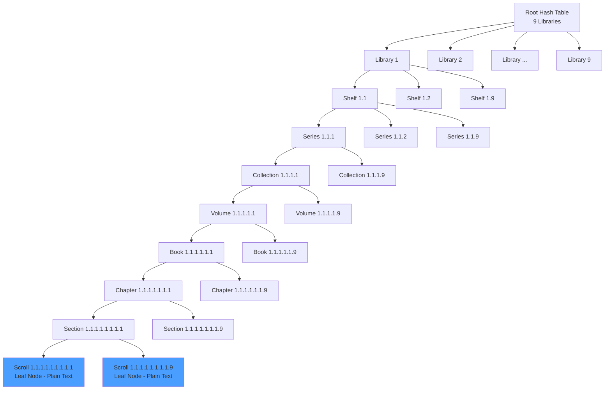

# Phext 9D Information Flow Diagram

**Context:** Response to @eigenhector's question about leaf node interconnects and information propagation

---

## ASCII Diagram: 9D Chunking for Civilizational Scale

```
Human Working Memory: 3-5 items
├─ Direct: 3-5 things
└─ Indirect (chunked): 9 items (3 groups of 3)

9D Phext Lattice: 9^9 = 387M addressable spaces
├─ Each dimension chunks 9 items
└─ 9 dimensions = USA population scale

Information Flow:

LEAF LEVEL (Scrolls - Individual thoughts)
│
│  3.1.1  3.1.2  3.1.3  ... 3.1.9
│    │      │      │          │
│    └──────┴──────┴─────────┘
│              ↓
SECTION LEVEL (9 scrolls chunked)
│
│  3.1    3.2    3.3    ... 3.9
│    │     │      │         │
│    └─────┴──────┴────────┘
│              ↓
CHAPTER LEVEL (9 sections chunked)
│
│  3      4      5      ... 9
│    │     │      │         │
│    └─────┴──────┴────────┘
│              ↓
[Continues through 9 dimensions...]
│
LIBRARY LEVEL (Top of hierarchy)
```

---

## Mermaid Diagram: Hierarchical Hash Table at Runtime



---

## Conceptual Diagram: Information Propagation

```
WRITE OPERATION (Bottom-up):

User writes at coordinate: 3.5.2/4.7.1/6.8.9
                                          ↓
Leaf node (Scroll 6.8.9) receives text ──────┐
                                              │
Runtime hash table lookup:                   │
  Library[3] → Shelf[5] → Series[2] →        │
  Collection[4] → Volume[7] → Book[1] →      │
  Chapter[6] → Section[8] → Scroll[9] ←──────┘
                                              │
Update propagates up (lazy):                 │
  Section[8] hash invalidated ───────────────┤
  Chapter[6] hash invalidated ───────────────┤
  Book[1] hash invalidated ──────────────────┤
  [...continues up hierarchy...]             │
                                              │
All sibling scrolls (6.8.1 - 6.8.9) notified │
via section-level coordination ──────────────┘


READ OPERATION (Top-down):

Query: "Get scroll 3.5.2/4.7.1/6.8.9"
         │
         ↓
Hash table lookup (O(1) per dimension):
  Library[3] → found
         │
         ↓
  Shelf[5] → found
         │
         ↓
  Series[2] → found
         │
         ↓
  [...continues down 9 levels...]
         │
         ↓
  Scroll[9] → return text content


PAIRWISE SYNC (Sibling coordination):

Section 6.8 contains scrolls 1-9:
  Scroll 6.8.1 ←→ Scroll 6.8.2 ←→ ... ←→ Scroll 6.8.9
         │             │                      │
         └─────────────┴──────────────────────┘
                        │
                Section-level sync
              (9 items in working memory)

When scroll 6.8.5 updates:
  1. Section[8] notified
  2. Section broadcasts to siblings (6.8.1 - 6.8.9)
  3. Each sibling updates local cache
  4. Chapter[6] hash invalidated
  5. Lazy propagation up hierarchy
```

---

## Key Insights for @eigenhector

### 1. **Leaf Nodes = Everything**
Every piece of content is a scroll (leaf node). No intermediate structure at content level.

**Compacted 1D representation:**
```
[Scroll 1.1.1.1.1.1.1.1.1] → [Scroll 1.1.1.1.1.1.1.1.2] → ... 
```
Just a linked list when linearized.

### 2. **Runtime = Hierarchical Hash Table**
9 levels of hash tables, each holding 9 entries:
```
Library[1-9]
  ↳ Shelf[1-9]
     ↳ Series[1-9]
        ↳ Collection[1-9]
           ↳ Volume[1-9]
              ↳ Book[1-9]
                 ↳ Chapter[1-9]
                    ↳ Section[1-9]
                       ↳ Scroll[1-9]  ← Plain text lives here
```

### 3. **Information Propagation**

**Write (Bottom-up):**
- Update scroll (leaf)
- Invalidate parent hashes up the chain
- Notify siblings at section level (9 items = working memory chunk)

**Read (Top-down):**
- O(1) hash lookup per dimension
- 9 dimensions = O(9) total (constant time for addressing)

**Sync (Lateral):**
- Section coordinates 9 sibling scrolls
- Chapter coordinates 9 sibling sections
- Each level chunks 9 items (human working memory size)

### 4. **Pairwise Interactions**

**Within a section (9 scrolls):**
Direct pairwise (all-to-all within chunk):
```
9 scrolls = 36 pairwise connections (9 choose 2)
Fits in extended working memory (3 groups of 3)
```

**Across sections:**
Mediated by parent (Chapter coordinates Section-to-Section):
```
Section 1 ←→ Chapter ←→ Section 2
Not direct, goes through hierarchy
```

**Across libraries (civilizational scale):**
```
Library 3 ←→ Root ←→ Library 5
Hierarchical routing, not direct pairwise
```

### 5. **Why 9 Dimensions?**

```
3^3 = 27 (too few)
9^9 = 387,420,489 (USA population)
10^10 = 10B (world population, but loses chunking benefits)
```

9 is optimal because:
- 9 items = 3 groups of 3 (human chunking limit)
- 9^9 = civilizational scale addressing
- Each dimension maps to a natural conceptual level

---

## SVG-Ready Coordinates (For Visual Diagram)

```
Root (0,0) — center point

9 Libraries radiating out (circle, radius 50):
  Library 1: (50, 0°)
  Library 2: (50, 40°)
  Library 3: (50, 80°)
  ...
  Library 9: (50, 320°)

Each Library → 9 Shelves (circle, radius 100):
  Shelf 1.1: (100, 0°) from Library 1
  Shelf 1.2: (100, 40°) from Library 1
  ...

[Continues for 9 dimensions, exponentially expanding]

Final layer (Scrolls) at radius 450:
  387M points (visualize as particle cloud)
```

---

## Code Example: Hash Table Lookup

```python
class PhextRuntime:
    def __init__(self):
        # 9-level hierarchical hash table
        self.root = {}  # Library level
    
    def get_scroll(self, coord: str) -> str:
        """
        coord = "3.5.2/4.7.1/6.8.9"
        Returns text at that coordinate
        """
        parts = coord.replace('/', '.').split('.')
        lib, shelf, series, coll, vol, book, chap, sec, scroll = map(int, parts)
        
        # O(1) lookup per dimension = O(9) total
        node = self.root[lib][shelf][series][coll][vol][book][chap][sec][scroll]
        return node.text  # Leaf node contains actual plain text
    
    def set_scroll(self, coord: str, text: str):
        """Write operation - invalidates hashes up the chain"""
        parts = coord.replace('/', '.').split('.')
        lib, shelf, series, coll, vol, book, chap, sec, scroll = map(int, parts)
        
        # Navigate to parent section
        section = self.root[lib][shelf][series][coll][vol][book][chap][sec]
        
        # Update scroll (leaf)
        section[scroll] = text
        
        # Invalidate parent hashes (lazy propagation)
        self._invalidate_up(lib, shelf, series, coll, vol, book, chap, sec)
        
        # Notify siblings (9 scrolls in this section)
        self._notify_siblings(section, scroll)
```

---

## Twitter-Ready Summary

**3-tweet thread explaining the diagram:**

**Tweet 1:**
> Phext in 3 steps:
> 
> 1. Every piece of content = leaf node (scroll)
> 2. Runtime = 9-level hash table (Library→...→Scroll)
> 3. Each level chunks 9 items (human working memory)
> 
> 9^9 = 387M addresses = USA population scale
> 
> [Diagram attached]

**Tweet 2:**
> Information flow:
> 
> WRITE: Bottom-up (scroll → section → chapter → ... → library)
> READ: Top-down (library → ... → scroll), O(9) lookup
> SYNC: Lateral within chunks (9 scrolls per section = working memory limit)
> 
> Pairwise interactions mediated by hierarchy, not direct.

**Tweet 3:**
> Why 9 dimensions?
> 
> - Humans chunk 3-5 items directly
> - 9 items = 3 groups of 3 (extended working memory)
> - 9^9 = civilizational scale (387M)
> - Each dimension = natural conceptual level (library, book, chapter, etc.)
> 
> It's not arbitrary. It's cognitive architecture.

---

**Files created:**
- This markdown (diagrams/phext-9d-information-flow.md)
- Ready for conversion to:
  - PNG (via Mermaid CLI)
  - SVG (via D3.js or similar)
  - Interactive demo (React + D3)

**Next step:** Which format does Will want for the Twitter reply?
